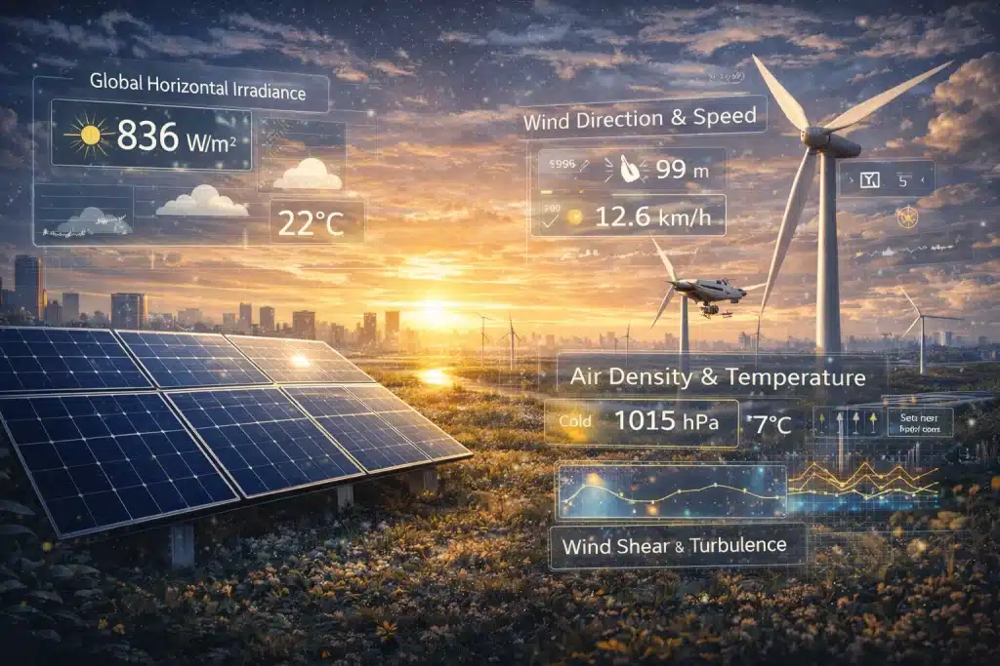
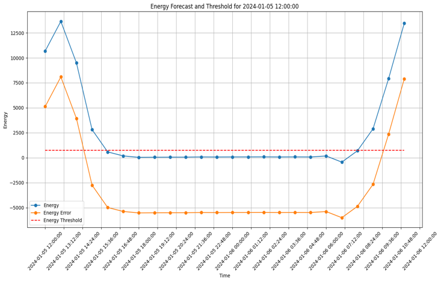

# ⚡ Predicting Surplus Energy Using Weather Data

Data Science Project

A data science and machine learning project investigating whether historical weather and energy data can be used to predict **surplus renewable energy at least 24 hours in advance**.

---

## 📌 Project Overview

With increasing energy prices and growing adoption of renewable energy, energy providers are exploring new ways to use periods of excess renewable generation.

The proposed service would allow local customers living near renewable energy sources to access **free electricity during periods of surplus energy**.

However, before such a service can be implemented, the energy provider needs a reliable system capable of predicting whether sufficient surplus energy will be available **at least 24 hours in advance**.

This project investigates the feasibility of developing such a prediction system using historical weather and energy data.

The company's primary concern is **minimising false positives**, because incorrectly predicting surplus energy could result in the company providing free electricity when insufficient renewable energy is actually available.

---

# 🎯 Project Objective

The main objective of this project is:

> **To predict whether sufficient surplus renewable energy will be available at least 24 hours in advance using historical weather and energy data.**

The project focuses particularly on **solar radiation** as the main renewable-energy source used for the final energy estimation.

The overall workflow is:

```text
Historical Weather & Energy Data
              │
              ▼
       Data Exploration
              │
              ▼
      Data Preprocessing
              │
              ▼
      Feature Engineering
              │
              ▼
     Machine Learning Model
              │
              ▼
   24-Hour-Ahead Prediction
              │
              ▼
   Solar Energy Estimation
              │
              ▼
    Energy vs Consumption
              │
              ▼
       Surplus / No Surplus
              │
              ▼
       Final Recommendation
```
# Dataset

The project uses historical weather and energy records provided for the **Brighton area**, covering data from approximately **2000 onwards**.

The dataset contains weather-related variables that can be used to investigate the relationship between weather conditions and renewable energy availability.

The analysis considers variables such as:

- Solar radiation
- Solar energy
- Wind speed
- Temperature
- Other available weather variables

Although both wind and solar energy are considered initially, the final analysis focuses primarily on **solar radiation**.

# 🤖 Data Science & Machine Learning

The project includes the following stages:

### 1. Data Exploration

The historical data is explored to understand:

- Missing values
- Data distributions
- Relationships between variables
- Temporal patterns
- Renewable-energy availability
- Weather conditions

### 2. Data Preparation

The data is divided into appropriate datasets for:

- Training
- Validation
- Testing

### 3. Feature Engineering

Weather variables are investigated and transformed where necessary to create useful features for prediction.

### 4. Prediction

Machine learning techniques are used to predict future energy availability based on historical observations.

The main requirement is to provide a prediction **at least 24 hours ahead**.

### 5. Energy Estimation

Predicted solar radiation is converted into estimated electrical energy using assumptions about:

- Solar-panel area
- Solar-panel efficiency
- Solar radiation
- Performance ratio
- Number of solar panels

### 6. Surplus Assessment

The estimated renewable energy is compared with expected customer consumption to determine whether sufficient energy would be available.

# ☀️ Solar Energy Model

The project focuses on solar radiation because it provides a measurable weather-based variable that can be used to estimate potential solar energy generation.

The estimated electrical energy is calculated using:

**E = A × r × H × PR**

Where:

| Variable | Description |
|---|---|
| **E** | Estimated electrical energy |
| **A** | Surface area exposed to solar radiation |
| **r** | Solar-panel/system efficiency |
| **H** | Solar radiation |
| **PR** | Performance ratio |

### Solar-Panel Assumptions

For the project, the following assumptions are used:

| Parameter | Assumption |
|---|---:|
| Panel area (A) | 1.5 m² |
| Efficiency (r) | 0.5 |
| Performance ratio (PR) | 0.7 |
| Number of solar panels | 200 |

The predicted solar radiation is used to estimate the potential energy generated by the solar panels.

# 🌬️ Wind Energy Consideration

Wind energy was also considered as a potential renewable-energy source.

The power captured by a wind turbine can be represented by:

**Pₘ = ½ρACₚ(λ, β)u³**

Where:

- **ρ** = Air density
- **A** = Swept area of the turbine
- **Cₚ** = Wind-turbine power coefficient
- **λ** = Tip-speed ratio
- **β** = Blade pitch angle
- **u** = Wind speed

### Assumptions

For the initial wind-energy analysis:

**Air density**

**ρ = 1.225 kg/m³**

This represents a commonly used standard air-density assumption at sea level under standard atmospheric conditions.

**Turbine blade radius**

The blade radius is assumed to be:

**r = 50 m**

Therefore, the swept area is:

**A = πr²**

**A ≈ 7853.98 m²**

**Power coefficient**

A value of:

**Cₚ = 0.25**

is assumed for the analysis.

Although wind energy is considered in the initial investigation, the project ultimately focuses on **solar radiation and solar energy** for the main analysis.

# 🏠 Energy Consumption

To determine whether the predicted renewable energy represents a genuine surplus, expected customer consumption must also be estimated.

The project assumes:

| Parameter | Assumption |
|---|---:|
| Number of houses | 500 |
| Average energy consumption | ~0.5 kWh/hour per house |
| Increased consumption behaviour | 3× normal consumption |

Historical UK household energy consumption has been used as a basis for estimating average household electricity usage.

An approximate annual household consumption of **3,700 kWh** corresponds to approximately:

**3,700 ÷ 365 ≈ 10.1 kWh/day**

and:

**10.1 ÷ 24 ≈ 0.42 kWh/hour**

For simplicity, the project uses approximately **0.5 kWh per household per hour**.

# 👥 Customer Behaviour

An important consideration is that customers may change their behaviour when electricity is offered for free.

Therefore, the project assumes that consumption could increase to approximately **three times normal consumption** during periods when customers are notified that free energy is available.

This assumption is incorporated into the surplus-energy calculation.

The project therefore compares:
```text

Predicted Renewable Energy
          │
          ▼
    Energy Generated
          │
          ▼
     ┌─────────────┐
     │             │
     ▼             ▼
Consumption    Surplus
     │             │
     └──────┬──────┘
            ▼
   Is sufficient energy
       available?
```
# ⚠️ False Positives

A key requirement of the project is to **minimise false-positive predictions**.

A false positive occurs when the system predicts that sufficient surplus energy will be available, but the actual renewable energy generated is insufficient.

This is particularly important because the company could experience financial losses by offering free electricity when there is not enough surplus energy.

Therefore, model evaluation should pay particular attention to:

- Precision
- False-positive rate
- Confusion matrix
- Recall
- F1-score
- Prediction reliability

The final model should prioritise reliable identification of genuine surplus periods rather than simply maximising overall accuracy.



# 🛠️ Technologies & Libraries

The project is implemented in **Python** using **Jupyter Notebook**.

### Programming

- 🐍 Python
- 📓 Jupyter Notebook

### Data Science

- NumPy
- Pandas
- Scikit-learn

### Visualisation

- Matplotlib
- Seaborn

### Main Libraries

| Library | Purpose |
|---|---|
| **NumPy** | Numerical computing and array operations |
| **Pandas** | Data manipulation and analysis |
| **Scikit-learn** | Machine learning and model evaluation |
| **Matplotlib** | Data visualisation |
| **Seaborn** | Statistical visualisation |

---

# 🚀 How to Run the Project

## Option 1 — Jupyter Notebook

If Jupyter Notebook is installed on your computer:

1. Clone or download this repository.
2. Install the required Python libraries.
3. Place the Brighton CSV files in the required directory.
4. Open the notebooks in Jupyter.
5. Run the data-exploration notebook first.
6. Generate the required training, validation, and test datasets.
7. Run the modelling and analysis notebooks.

8. ## Option 2 — Google Colab

The project can also be run using **Google Colab**.

Open:

[Google Colab](https://colab.research.google.com/)

Upload the project notebooks and required datasets.

The expected data directory is:

```text
weatherdata_for_students/
└── brighton/
    ├── Brighton CSV files
    └── ...
```
The data-exploration notebook should be run first so that the required training, validation, and test datasets can be generated.

# 📚 References

The project draws on research and technical sources relating to **wind-energy generation, solar-energy systems, and UK household energy consumption**.

### Wind Energy

[Wind Resource and Wind Power Generation Assessment for Education in Engineering](https://www.mdpi.com/2071-1050/13/5/2444)

### Solar Energy

[Calculation of Electrical Energy with Solar Power Plant Design](https://ieeexplore.ieee.org/abstract/document/7828701)

### Solar Panel Efficiency

[Efficiency Improvement for Solar Cell Panels by Cooling](https://ieeexplore.ieee.org/abstract/document/8724625)

### UK Household Energy Consumption

[Energy Consumption in UK Households: Impact of Domestic Electrical Appliances](https://www.sciencedirect.com/science/article/pii/0306261996000013)

# 🎓 Academic Project

**Module:** CE888 — Data Science

**Project:** Predicting Surplus Energy Using Weather Data

The project investigates the application of **data science, machine learning, weather analysis, and renewable-energy modelling** to support decision-making in a potential free-energy service.

---

## 👩‍💻 Author

**Zeinab Dast Mozd**

MSc Artificial Intelligence

Research interests include:

- Machine Learning
- Artificial Intelligence
- Data Science
- Natural Language Processing
- Large Language Models
- AI for Energy & Sustainability
